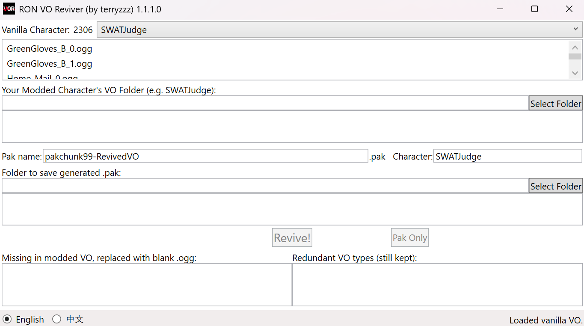
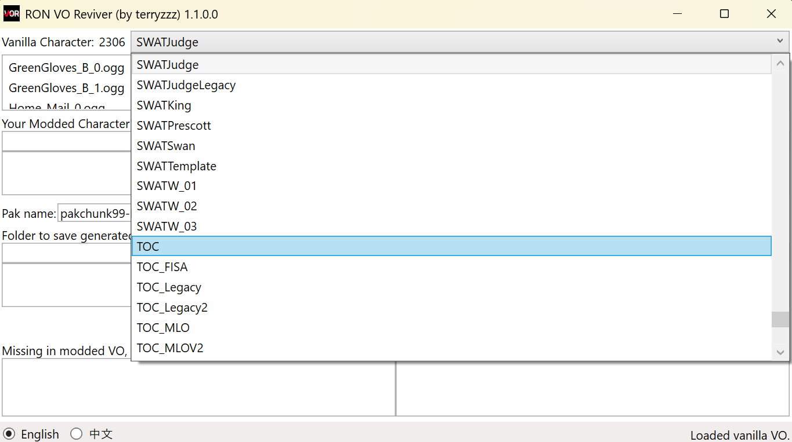
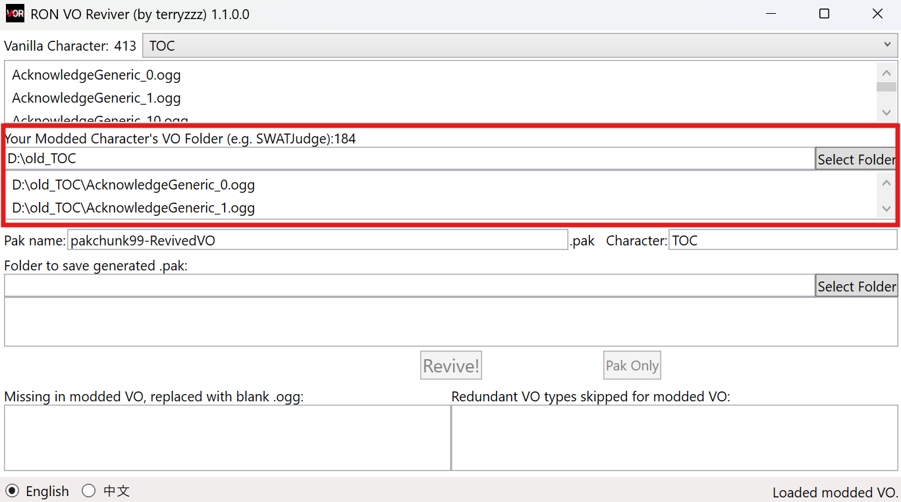
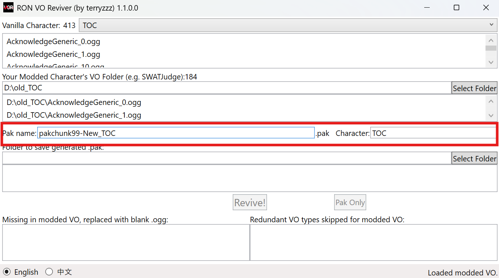
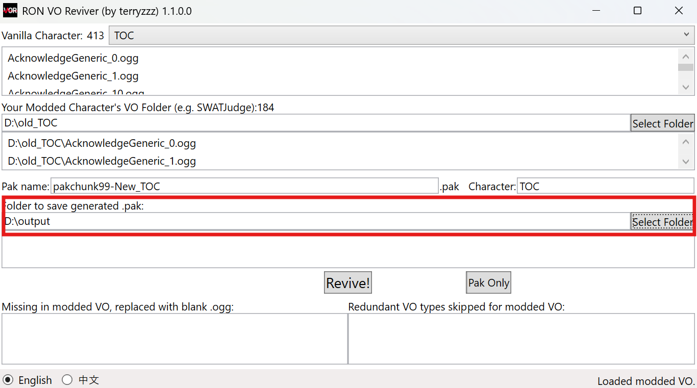
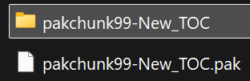

# RON VO Reviver

This is a Ready or Not VO mod utility tool that greatly simplifies the process of creating .pak VO mods for LSS Update or post-LSS unpaked version. The following features are supported:

- Transparent reading and cloning process
- Auto audio conversion from common formats to .ogg (quality=6)
- Auto multi-language subtitle files matching
- Missing VO type listing and substitution with blank audio
- Special "-S" type handling for SWAT characters
- Auto paking (**unpaked version also available for creating post-LSS mods**)
- English and Simplifed Chinese UI
- ...

Existing mods can be revived and packed within a few clicks. For modders creating new VO mods, **this tool also fills extra variants by copy existing ones from the mod files**. (e.g. there are 38 variants of yelling at civilian VO in vanilla game but only 10 from your mod, this tool copy & paste the 10 VOs to the count of 38)

If your mod does not contain "S" variants of voiceline (e.g. `[CALL]ArrestMaleS` is the "S" variant of `[CALL]ArrestMale`), this tool also trys to copy from non-"S" variants for filling up.

## How to Use

### 1. Select vanilla VO character

There's **no need** to prepare the full set of vanilla VO files. Simply choose the desired character from the drop-down menu and you will see the full list of original VO filenames.

### 2. Select the folder of your modded VO

E.g. if your modded character is `SWATJudge`, The path should be `<SomePath>\SWATJudge`. The list view below will show all valid VO files after selecting the folder.

Subtitle files (in format of `sub_*.csv`) in this folder will also be loaded. Note that subtitles are **not compulsory** and you may put in whatever languages supported by your mod.

### 3. Edit your .pak name and check the Character Name

### 4. Choose the folder to save your generated files

### 5. Click the `Revive!` button

- Your packed mod, along with the unpacked version can be found under the same folder. In case that you need to adjust file names, subtitles, etc., you may also click the `Pak Only` button to pak the mod again after modifying in the unpacked folder.

